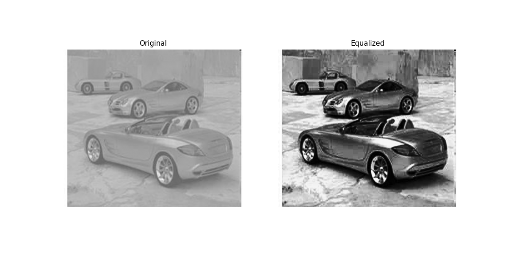

# Histogram Equalization

This repository contains a Python implementation of the **Histogram Equalization** algorithm. The project was developed as an image processing assignment to enhance the contrast of low-quality grayscale images without using built-in library functions like `cv2.equalizeHist()`.

## 📌 Project Overview
The main goal of this project is to take a "foggy" or low-contrast grayscale image and redistribute its pixel intensities to cover the full range (0-255). This results in a much clearer and more detailed image.

## 🛠️ Tech Stack
- **Python**: Core programming language.
- **NumPy**: Used for matrix operations and histogram calculations.
- **Matplotlib**: Used for displaying and saving the comparison results.
- **OpenCV**: Used strictly for reading and writing image files.

## ⚙️ How the Algorithm Works
The code follows a 4-step manual process:
1. **Histogram Calculation**: Flattening the image and counting the frequency of each intensity level.
2. **Cumulative Distribution Function (CDF)**: Calculating the cumulative sum of the pixel counts.
3. **Normalization**: Scaling the CDF values to fit precisely within the 0-255 range.
4. **Mapping**: Re-assigning each original pixel to its new "equalized" value.

## 📊 Results
Below is the visual output of the algorithm. The left side shows the original low-contrast image, and the right side shows the result after the manual histogram equalization process.

*As observed, the algorithm significantly improves the visibility of details on the cars and the textures on the ground.*

## 📂 File Structure
- `main.py`: The source code containing the manual implementation.
- `Resim1.png`: The original input image.
- `output_result.png`: The final comparison plot.
